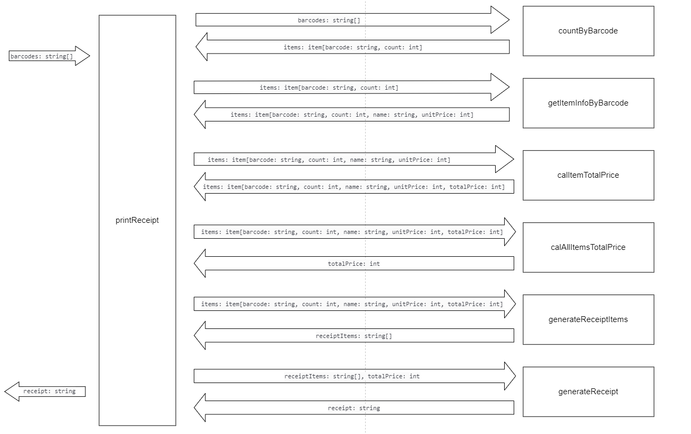

# PROCESS

### Tasking

1. 统计每个barcode的数量
   * 输入：`barcodes: string[]`
   * 输出： `items: item[barcode: string, count: int]`
2. 获取每个item的详细信息
   * 输入：`items: item[barcode: string, count: int]`
   * 输出：`items: item[barcode: string, count: int, name: string, unitPrice: int]`
3. 计算每个item的总价
   * 输入：`items: item[barcode: string, count: int, name: string, unitPrice: int]`
   * 输出：`items: item[barcode: string, count: int, name: string, unitPrice: int, totalPrice: int]`
4. 计算所有item的总价
   * 输入：`items: item[barcode: string, count: int, name: string, unitPrice: int, totalPrice: int]`
   * 输出：`totalPrice: int`
5. 生成每个item的发票信息
   * 输入：`items: item[barcode: string, count: int, name: string, unitPrice: int, totalPrice: int]`
   * 输出：`receiptItems: string[]`
6. 格式化发票信息
   * 输入：`receiptItems: string[], totalPrice: int`
   * 输出：`receipt: string`
7. 打印发票信息
   * 输入：`receipt: string`
   * 输出：打印`receipt`

### Context Diagram

#### PDCA

| | 统计每个barcode的数量 |
|  ----  | ----  |
|  P  |  3min |
|  D  |  4min |
|  C  |  对js的数组操作方法不熟悉 |
|  A  |  通过练习来熟悉数组的操作方法 |

| | 获取每个item的详细信息 |
|  ----  | ----  |
|  P  |  3min |
|  D  |  3min |
|  C  |  none |
|  A  |  none |

| | 计算每个item的总价 |
|  ----  | ----  |
|  P  |  1min |
|  D  |  1min |
|  C  |  none |
|  A  |  none |

| | 计算所有item的总价 |
|  ----  | ----  |
|  P  |  1min |
|  D  |  1min |
|  C  |  none |
|  A  |  none |

| | 生成每个item的发票信息 |
|  ----  | ----  |
|  P  |  1min |
|  D  |  1min |
|  C  |  none |
|  A  |  none |

| | 格式化发票信息 |
|  ----  | ----  |
|  P  |  3min |
|  D  |  10min |
|  C  |  由于换行符少加或多加，字符串格式跑不过测试 |
|  A  |  多尝试 |

| | 打印发票信息 |
|  ----  | ----  |
|  P  | 1min  |
|  D  | 1min  |
|  C  |  none |
|  A  |  none |
